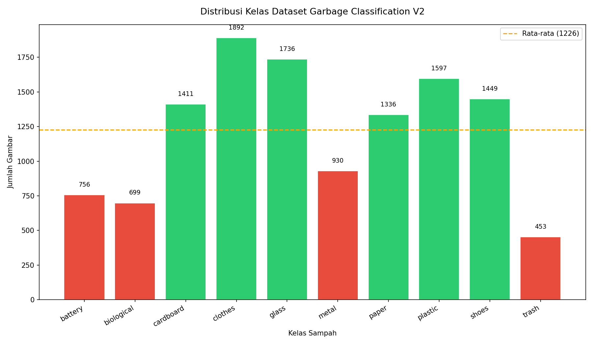
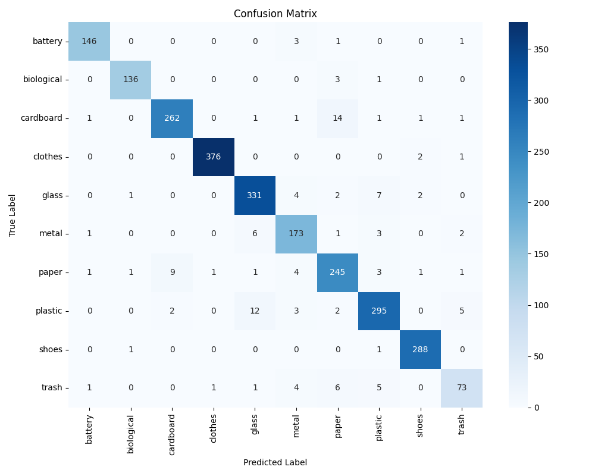
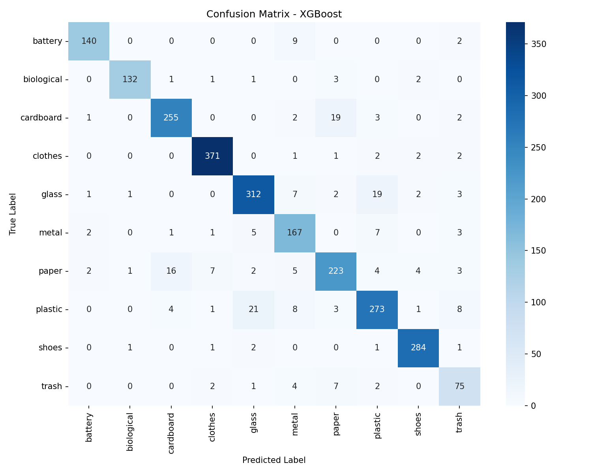

#  Klasifikasi Jenis Sampah Berbasis EfficientNet-B0 + SVM/XGBoost

> **ADVANZ Team 7 — Proyek Akhir Machine Learning**  
> Universitas Negeri Surabaya (UNESA) · 2025/2026

[](https://python.org)
[](https://tensorflow.org)
[](https://streamlit.io)
[](LICENSE)

---

##  Deskripsi Proyek

Volume sampah perkotaan di Indonesia meningkat signifikan, namun pemilahan sampah secara manual tidak efisien dan kapasitas TPA semakin terbatas. Repository ini mengimplementasikan pipeline klasifikasi sampah berbasis citra menggunakan **EfficientNet-B0 sebagai feature extractor** yang dikombinasikan dengan dua classifier tradisional (**SVM** dan **XGBoost**) untuk membandingkan performa keduanya pada dataset 10 kelas sampah.

---

##  Tim ADVANZ — Team 7

| Nama | NIM |
|------|-----|
| Arya Bintang Fauzildan | 24031554127 |
| Ivan Andika Setyawan | 24031554085 |
| E. Adi Sforza Syahrul Ramadhan | 24031554113 |

---

##  Struktur Repository

```
UAS_ML_TEAM_7/
├── Model Train/
│   ├── SVM.py                  # Training script SVM (RBF kernel, C=10)
│   └── XGBoost.py              # Training script XGBoost (100 estimators)
├── Model/
│   ├── svm_model.joblib        # Trained SVM model (~56MB)
│   ├── xgboost_model.json      # Trained XGBoost model
│   ├── scaler.joblib           # StandardScaler (WAJIB digunakan sebelum inferensi)
│   └── Placeholder.txt
├── features/
│   ├── train_features.npy      # EfficientNet-B0 embeddings train (11457 × 1280)
│   ├── test_features.npy       # EfficientNet-B0 embeddings test  (2452 × 1280)
│   ├── train_labels.npy
│   ├── test_labels.npy
│   ├── train_paths.npy
│   ├── test_paths.npy
│   └── class_names.npy         # 10 nama kelas
├── gambar/
│   ├── confusion_matrix.png         # CM SVM
│   ├── confusion_matrix_xgboost.png # CM XGBoost
│   └── distribusi_kelas.png
├── Laporan Akhir/
│   ├── Laporan Akhir - ADVANZ_Team 7.pdf
│   └── Poster_Tim ADVANZ MOLEH.pdf
├── Proposal/
├── Progres/
├── main.ipynb                  # Notebook lengkap (EDA + feature extraction)
├── app.py                      # Streamlit inference dashboard
└── requirements.txt
```

---

##  Dataset


- **Sumber:** [Garbage Classification V2 — Kaggle](https://www.kaggle.com/datasets/sumn2u/garbage-classification-v2)
- **Total Gambar:** 13.909 (train: 11.457 · test: 2.452)
- **Split:** 80% train / 20% test (stratified, `random_state=42`)
- **Ukuran Input:** 224×224 piksel (RGB)
- **Preprocessing:** `EfficientNet preprocess_input` + standardisasi via `StandardScaler`

### Kelas (10 Kategori)

| No | Kelas | No | Kelas |
|----|-------|----|-------|
| 1 | battery | 6 | metal |
| 2 | biological | 7 | paper |
| 3 | cardboard | 8 | plastic |
| 4 | clothes | 9 | shoes |
| 5 | glass | 10 | **trash**  |

>  Kelas `trash` secara konsisten menunjukkan performa terendah pada kedua model karena bersifat heterogen (tidak memiliki ciri visual yang dominan).

---

## Arsitektur Pipeline

```
Input Gambar (224×224 RGB)
        │
        ▼
┌───────────────────────────────┐
│  EfficientNet-B0 (ImageNet)   │  ← Frozen Feature Extractor
│  GlobalAveragePooling2D       │
│  Output: vektor 1280-dim      │
└───────────────────────────────┘
        │
        ▼
  StandardScaler (fit pada train)
  [scaler.joblib — WAJIB diapply]
        │
       / \
      /   \
     ▼     ▼
┌────────┐ ┌──────────┐
│  SVM   │ │ XGBoost  │
│ (RBF)  │ │(100 est) │
└────────┘ └──────────┘
     │           │
     ▼           ▼
  Prediksi    Prediksi
  Kelas       Kelas
```

---

##  Hasil & Evaluasi

### Perbandingan Model

| Model | Precision | Recall | F1-Score |
|-------|-----------|--------|----------|
| **SVM** (RBF, C=10) | **0.94** | **0.94** | **0.94** |
| XGBoost (100 est.) | 0.91 | 0.91 | 0.91 |

### Confusion Matrix

**SVM:**



**XGBoost:**



### Insight Utama

- SVM dengan kernel RBF unggul ~3 poin F1 dibanding XGBoost pada fitur high-dimensional (1280-dim) — konsisten dengan karakteristik SVM yang kuat di ruang berdimensi tinggi.
- Kelas `trash` merupakan kelas terlemah di kedua model akibat variasi visual yang tinggi dan tidak memiliki pola tekstur/bentuk yang khas.
- `scaler.joblib` **harus selalu diterapkan** antara ekstraksi fitur dan inferensi; melewati langkah ini menyebabkan degradasi performa signifikan.

---

##  Cara Menjalankan

### 1. Instalasi Dependensi

```bash
pip install -r requirements.txt
```

**Dependensi pinned:**

```
tensorflow==2.21.0
scikit-learn==1.6.1
xgboost==3.2.0
joblib==1.4.2
numpy==2.2.2
pillow==11.1.0
streamlit==1.58.0
plotly==5.24.1
```

### 2. Feature Extraction (jika melatih ulang)

Jalankan `main.ipynb` dari awal. Pastikan path dataset udah disesuaikan.

### 3. Training Model

```bash
# SVM
python "Model Train/SVM.py"

# XGBoost
python "Model Train/XGBoost.py"
```

### 4. Inference Dashboard (Streamlit)

```bash
streamlit run app.py
```

*Repository ini merupakan bagian dari tugas akhir mata kuliah Machine Learning, Program Studi Sains Data, Universitas Negeri Surabaya.*
